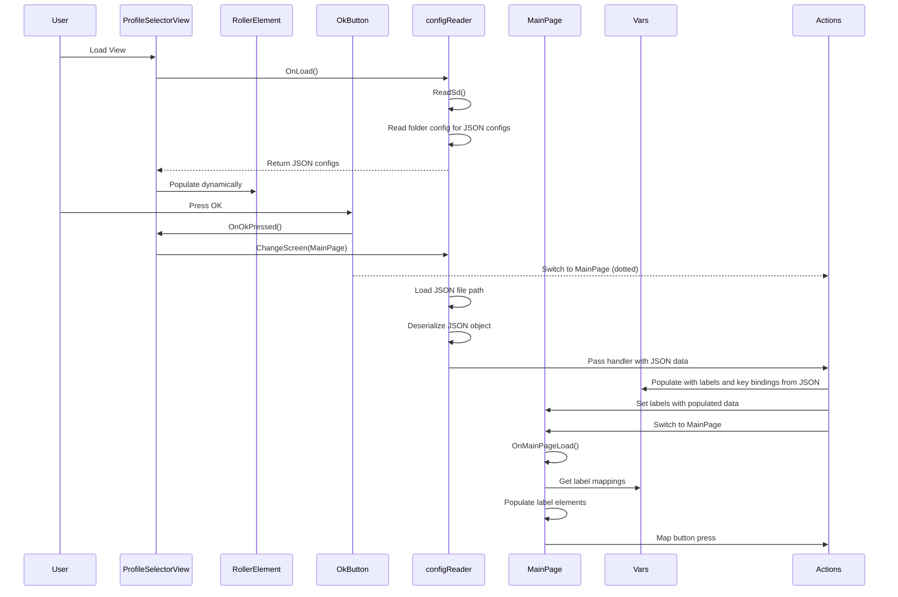

# Bluetooth Macrokeys ESP32 JC2432W28C Guition implementation

## Features 
 - EEZ studio -> LVGl native cpp implementation

 - BleKeyboard library (uses NimBLE so save RAM)

 - Loads json profiles from Sd card by reading macrokeys/config folder

 - Two Tabbed 3x2 Custom buttons, button box

- Deserialises json and button map from config

## Flow diagram

